# Proof of Concept
- Ho realizzato un esempio step by step di come si utilizza il tool
## Startup
- Ho implementato un docker compose per eseguire sia firegex che un servizio vulnerabile tramite XSS e SQLi
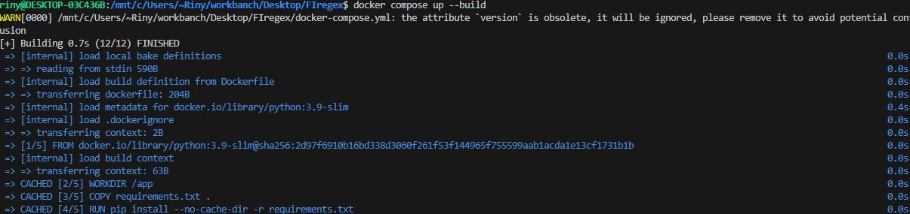
## Esecuzione script per PoC delle vulnerabilità
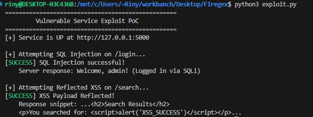
## Come si presenta l'app
- Ora segue una guida Step-by-Step di come creare un filtro regex per bloccare le richieste in entrata
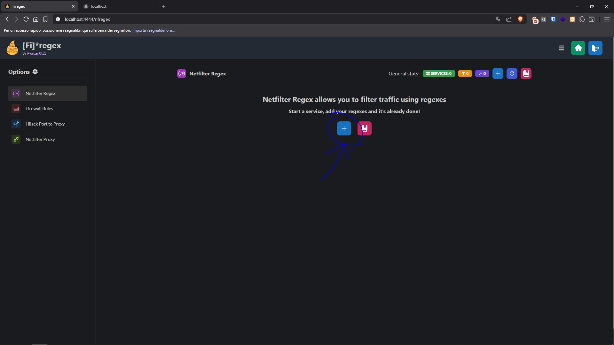
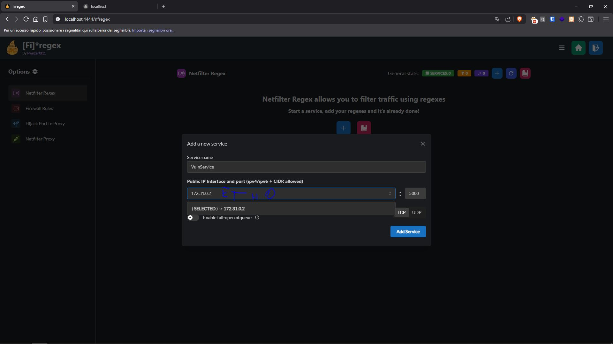
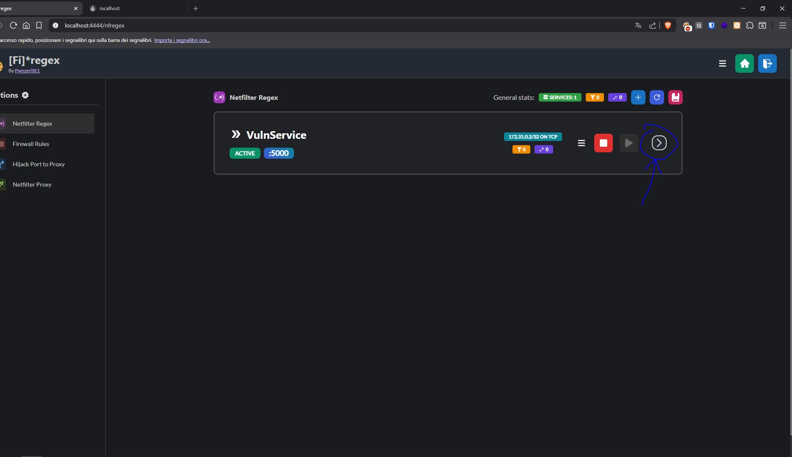
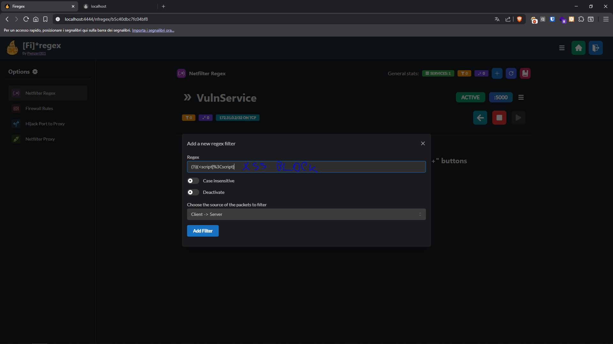
## Esecuzione script dopo il blocco XSS
- Ciò che accade all'esecuzione dello script è un blocco della richiesta fino allo scattare del timeout
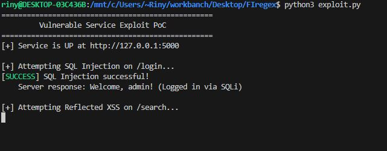
## Implementare una regola tramite script python
- Firegex permette di filtrare il traffico tramite script in python
- Guida step-by-step sul filtraggio su pattern
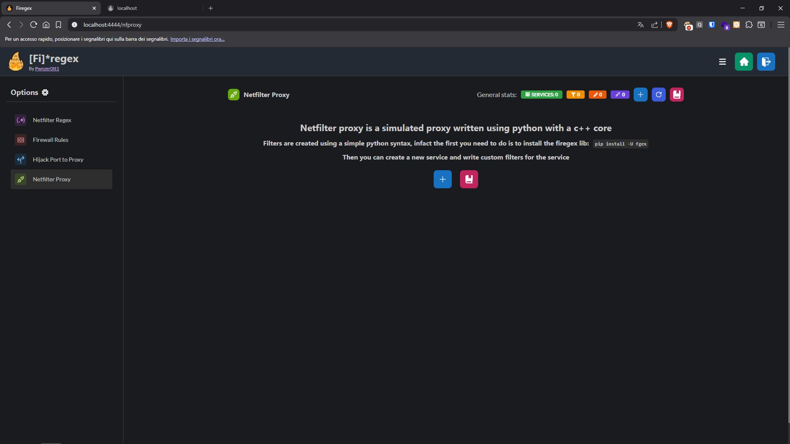
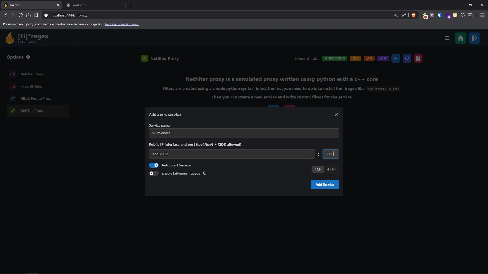
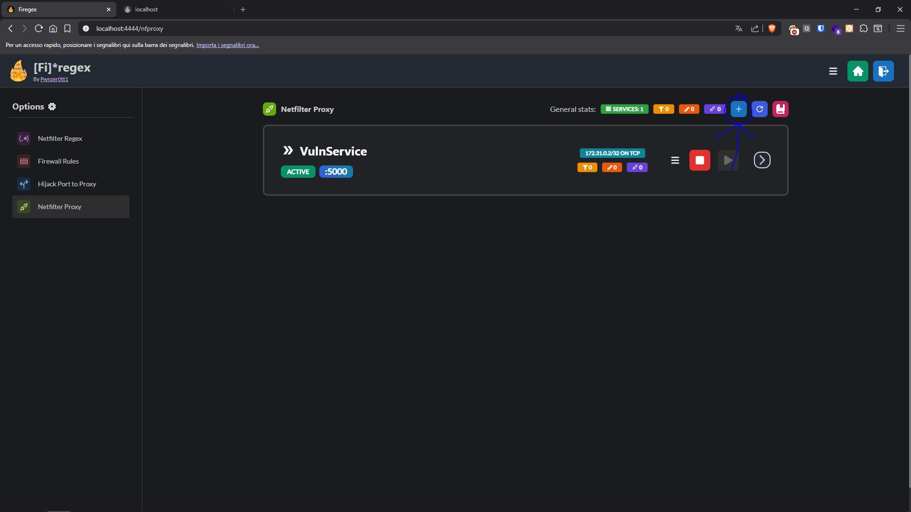
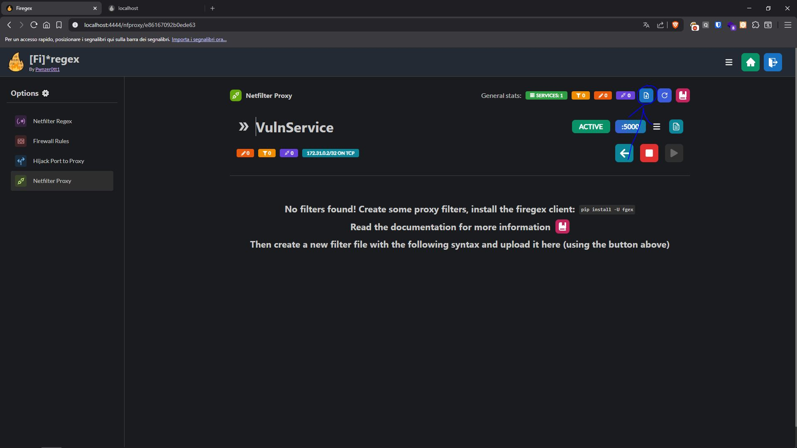
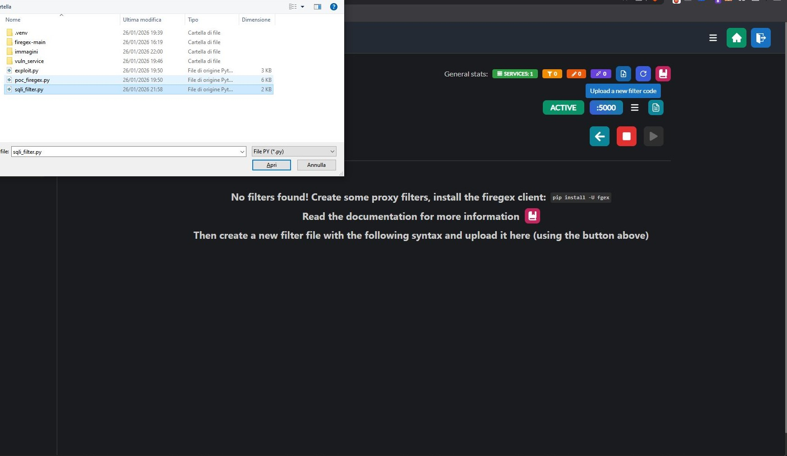
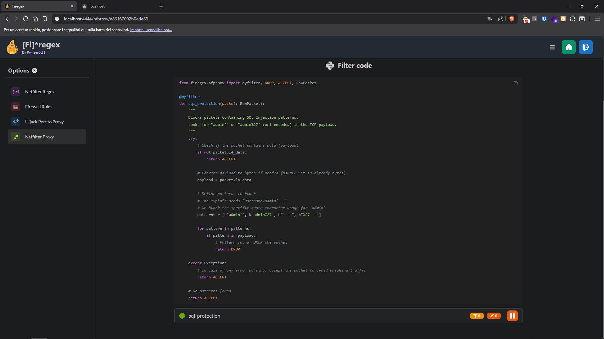
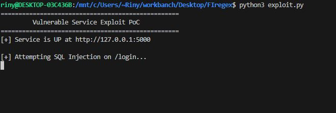