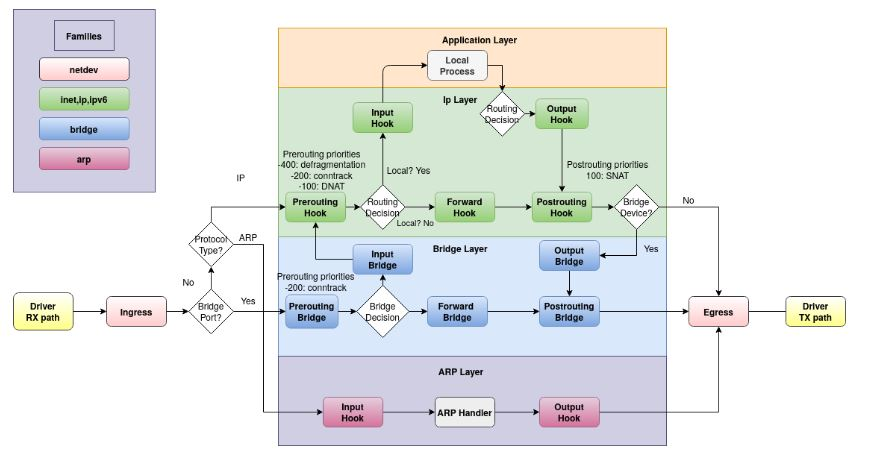
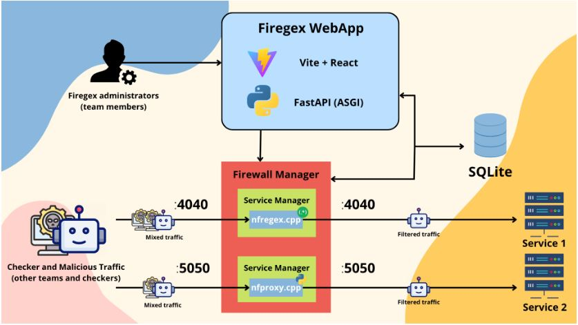
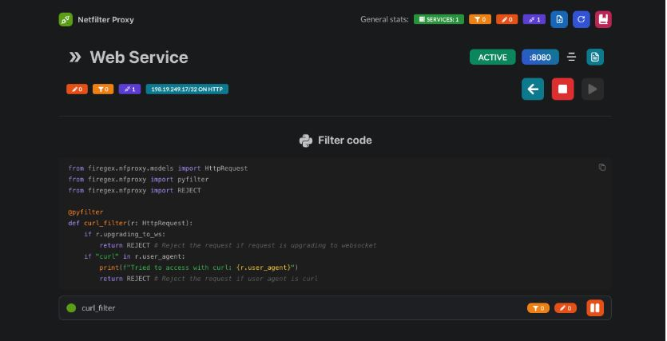

# Firegex
## Cosa è
- È un Software Defined FireWall
- Ideato per essere avviato con 0 config
- Si concentra sul non intaccare la SLA
- Offre soluzioni adattabili alle esigenze (tramite regex)
## Come gestisce il traffico
- Un pacchetto raggiunge l'interfaccia di rete
- Una volta raggiunto il kernel, viene gestito da Netfilter
- Netfilder aggiunge degli **hook**, ovvero dei punti di intercettazione
- I principali hook:
    - PREROUTING
        - dopo la ricezione del pacchetto
    - INPUT
        - attivo per i pacchetti destinati al sistema
    - FORWARD
        - attivo per i pacchetti in transito
    - OUTPUT
        - Elabora i pacchetti generati dal sistema
    - POSTROUTING
        - ultimo hook, prima della trasmissione del pacchetto

## Netfilter Tables
- Nftables è un framework moderno di filtraggio dei pacchetti e gestione del traffico su Linux
- Permette di definire regole che vengono eseguite nei vari hook
- Nftables è il meccanismo fondamentale per gestire il traffico secondo queste modalità:
    - Applicare regole di sicurezza
        - Nftables ha funzioni native sul filtraggio del traffico in base a ogni campo del pacchetto (non offre filtri regex in modo nativo)
    - Reindirizzare il traffico
        - Tramite la funzionalità Netfilter Port Hijack è possibile utilizzare le regole di NAT per deviare il traffico su un'altra porta (**proxy in modo trasparente**)
    - Netfilter Queue
        - Modulo nfqueue, definisce quando e quali pacchetti devono essere trasferiti dal kernel all'utente per elaborazioni avanzate (qui entra in gioco firegex)
## Netfilter Queue Module
- Rappresenta il core principale per firegex
- Ntqueue intercetta una richiesta in hook 
- Se la regola specifica l'azione `queue` il pacchetto viene inserito in una coda numerata
- Un'app si mette in ascolto per ricevere i pacchetti dalla coda
- Elabora il pacchetto e restituisce un **verdict**(ACCEPT, DROP..)
- Il kernel riceve il verdict e decide come continuare
- Vantaggi:
    - Accesso completo ai pacchetti dall'userspace
    - Trasparenza totale, l'utente è ignaro di quello che succede
    - Flessibilità nell'operazione, in quanto gestita da un'implementazione
    - Controllo granulare del flusso, possibilità di modificare pacchetti offre un controllo sul comportamento della rete
- Firegex implementa Netfilter regex Filter (nfregex) e nfproxy
## Architettura

- Firegex implementa un frontend tramite react(vite) e un backend in fastapi
- In oltre implementa anche dei moduli per funzionalità critiche in C++ (.exe precompilato)
    - Principalmente per gestire i pacchetti lato kernel e l'elaborazione di regex
- Lo startup è gestito tramite docker
- Frontend
    - permette la creazione, monitoraggio e gestione di filtri
- Backend
    - sfrutta FastAPI per gli endpoint HTTP
    - moduli C++ per funzioni critiche
    - Nel backend ritroviamo l'uso di `libnftables` per la gestione delle regole di rete
    - Chi sfurtta i moduli in C++ sono i pacchetti `nfregex` e `nfproxy`
    - L'uso di C++ per l'efficenza ha permesso il completamento dei seguenti obbiettivi:
        - Prestazioni elevate
            - Filtraggio del traffico con latenza minima
        - Parallelizazione
            - I filtri che richiedono elaborazione tramite nfqueue sono gestiti in modo multi-thread, garantendo una gestione del traffico ottimale anche sotto stress
        - Integrazione con librerie di rete
            - l'utilizzo di librerie in C++ come `libtins` e `libmnl` consentono l'implementazione di funzioni per eleborazione di pacchetti con basso costo computazionale e alta affidabilità
## Funzionalità (Moduli)
- Ci sono 4 pacchetti principali, ognuno con delle funzioni documentate per applicare i filtri
    - Nfregex
        - funzioni di creazione di filtri regex
        - utilizza nfqueue e nftables
        - intercetta le richieste a livello kernel
        - Permette l'utilizzo di regex PCRE (sintassi di PERL, più veloce, dettagliata e complessa)
        - Utilizzo di vectorscan (fork di hyperscan, libreria per eseguire regex ad alta velocità), l'utilizzo di un fork è dovuto alla compatibilità con arm64 e al basso consumo. 
        - Supporta IPv4, IPv6, TCP, UDP
    - Firewall
        - Controllo completo sul traffico di rete
        - sintassi simile a UFW
        - Non ci hanno messo mani più di tanto per paura di conflitti con firegex :(
    - Porthijack
        - Redirect del traffico
        - Permette di non cambiare le porte dei servizi in gara ma girare il traffico verso il proxy
    - Nfproxy
        - Possibilità di integrare filtri in python
        - Parsing e decodifica delle richieste HTTP
        - I filtri possono essere testati tramite il comando `fgex` prima di applicarlo
        - Interfaccia grafica
- Esempio nfproxy:
