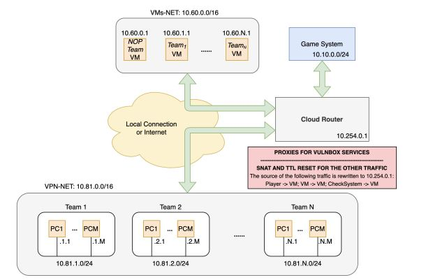
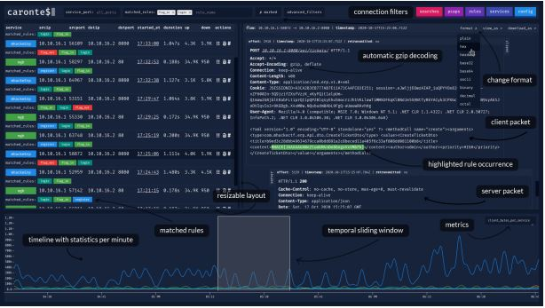
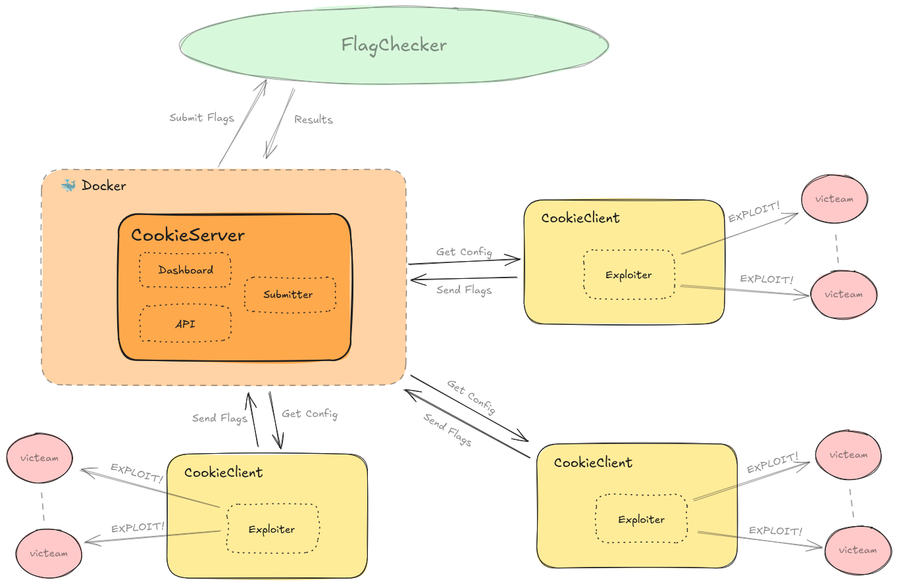

# Infrastruttura CyberChallenge A/D
## GameServer
- Centro dell'infrastruttura, gestisce la competizione
## Checker
- Monitora la SLA di ogni challenge sulle vm dei teams
- Verificano se il servizio è funzionante, andando ad eseguire azioni sul servizio
- È il checker a inserire la flag nel servizio
- Verifica che le flag dei tick precedenti siano raggiungibili
- Se i requisiti non sono soddisfatti, il gameserver considera il servizio inaccessibile.
- I checker sfruttano il comportamento corretto dell'app, non le vulnerabilità
## VM team
- Le VM dei partecipanti, ospitano i servizi vulnerabili
## Struttura della competizione
- La gara è svolta in tick(o round)
    - intervalli di tempo in cui i servizi vengono verificati dal checker
## NOP(No OPeration team) team
- Team fantioccio a cui sottrarre flag e testare il servizio
- Ovviamente le flag del NOP team non sono valide
## Flag ID
- Informazioni riguardanti il flag store per la realizzazione delle challs
- Vengono messi a disposizione da un API del gameserver
## SLA (Service Level Agreement)
- Misura la disponibilità del servizio
- Più il servizio è attivo (non mai down), più la percentuale di SLA aumenta
- In ogni momento in cui si abbassa la SLA si perdono punti
## Punti attacco
- Al submit delle flag, al gameserver, vengono ottenuti punti
- Generalmente scalati alla velocità di submit(rispetto agli altri team) e alla difficoltà della vuln trovata
## Punti difesa
- Quantifica l'inneficacia delle contromisure
- È calcolato da quante flag sono sottratte al tuo team
- È importante patchare senza intaccare la SLA
## Rete di gara

- Dedicato agli organizzatori
    - Gameserver e eventuali host al servizio
- Macchine dei team
    - Sottorete dove si ha accesso ssh alla propria macchina
- Host dei partecipanti
    - Sottorete realizzata tramite VPN per la connessione agli altri team
- Traffico anonimo e gestione traffico tramite regole
    - Realizzato dal cloud router
    - Tramite il NAT si nascondono gli IP, mascherando l'identità del mittente con quella del router
    - Questo ci è utile perchè è impossibile capire se le richieste provengono dagli altri team o dal checker
## Strumenti per le A/D
- Gli strumenti possono facilitare, o automatizzare, gli aspetti di un A/D
- Traffic Analyzer
    - Analizzare il traffico durante la competizione è cruciale
    - Il traffico che si riceve è molto vasto e difficile da comprendere
    - Con Caronte o Tulip è possibile l'analisi del traffico basato su regex (per FlagIN e FlagOUT)
    - Possibilità di customizzare, in colori, le richiesta
    - Durante l'analisi possono essere copiati exploit o studiati per essere patchati

- Tool di attacco
    - ExploitFarm o CookieFarm
        - Questi tool sono utili per la distribuzione di exploit e flag submission
        - Architettura di cookieFarm:

- Tool di difesa
    - Proxy e Firewall
        - Questi tool permettono di filtrare il traffico
        - Possono riconoscere e bloccare gli attacchi
        - Non sostituiscono il patching
        - Esempio di tool: Firegex o CTF proxy