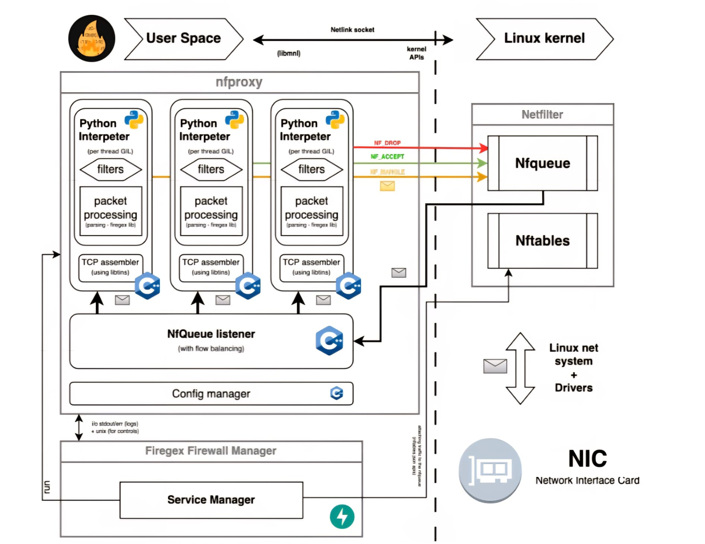
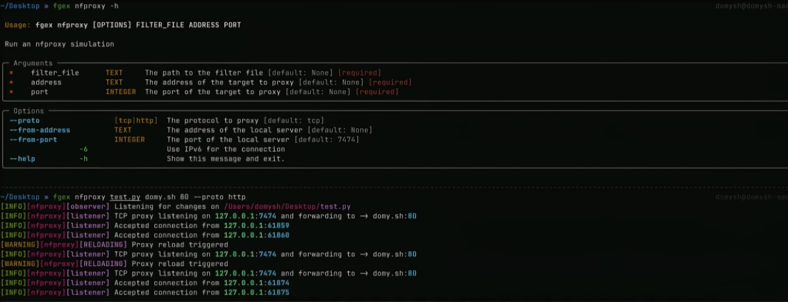

# Nfproxy
## Progettazione
- Analizzare servizi che usano HTTP con regex e difficile
- A discapito delle prestazioni, il modulo nfproxy offre la possibilita di scrivere filtri in python
- Offre supporto nativo agli algoritmi di compressione e codifiche comuni tramite parsing
- Modulo basato su nfqueue
- Permette controllo sul traffico pari a un proxy classico, ma con accesso ai pacchetti a livello di rete (layer 3)
- Limitato nella modifica del pacchetto (non grande limitazione in ambito di difesa)
- Gestone efficiene dei pacchetti (in C++)
- parsing dei protocolli applicativi (in python)
- Protocolli supportati: HTTP, Websocket, TCP
## Scelte effettuate
- Regole di filtraggio in Python
    - Funzioni ottimizzate, interfaccia in python per applicare i filtri
- Analisi di HTTP e Websocket
    - Decodifica automatica per B64
    - Decompressione automatica supportata per gzip, deflate, brotli, zstd, e permessage-deflate (Websocket)
- Ricostruzione stream TCP
    - Payload ordinato a livello di trasporto, indipendente dalla frammentazione
- Manipolazione degli header
    - Lettura e modifica dei campi negli header di rete e trasporto
- Compatibilita dual-stack
    - Elaborazione sia per IPv4 e IPv6
- Allocazione/deallocazione ottimizzata
    - Gestione automatica dei buffer
    - Evita memory leak e sovraccarichi
    - Completa trasparenza al programmatore
    - Config personallizzabili
- Diagiostica 
    - Notifica strutturate degli errori e log dettagliati
- Modifica dinamica delle regex
    - Attivazione/Deattivazione senza interrompere il servizio
- Elaborazione Concorrente
    - Garantisce scalabilita
- Validazione dei filtri
    - Filtri testabili in ambiente simulato prima di applicarli
## Archietettura
- Elaborazione in 3 layer
    - Config
        - All'avvio vengono configurate le regole nftables
    - Core C++
        - Viene inizializzato il componente C++ (logica centrale, gestione multi-thread, elaborazione dei pacchetti a basso livello e ricostruzione stream TCP) 
    - Boundary Python
        - Applicazione filtri Python definiti dall'utente ()

## Elaborazione pacchetti parellelizzata
- Implementazione guidata da tre obiettivi
    - Isolamento dati tra processi
        - Prevenire conflitti
    - Minimizzazione dei lock
        - Limitare l'uso di mutex per prevenire deadlock o degrado prestazionale
    - Ottimizzazione della memoria
        - Eliminazione copie ridondanti, riduzione latenza
- Pattern producer-consumer
    - Unico producer bindato a nfqueue, distribuisce i pacchetti a diverse code FIFO
    - I consumatori gestiscono in parallelo
        - Ordinamento dei pacchetti TCP
        - Applicazione dei filtri
        - Invio dei verdicts
- Sezione critica
    - L'unica risiede nell'accesso alle code, gestito tramite mutex 
    - Implementazione basata sulla pubblicazione di Arif Jaffer (Simple blocking queue: https://www.bit-byter.com/blog/files/blocking-q-java.html)

## Global Interpreter Lock (GIL)
- Problema del linguaggio Python, consente l'esecuzione di un thread alla volta
- Questo perche la gestione interna non e thread-safe
- Soluzione adottata in python 3.12 sfrutta PEP 684(Python Enhancement Proposal)
    - Permette esecuzione di interpreti python indipendenti dal processo, ciascuno con il proprio GIL, avviene esclusivamente tramite C API
- Questa soluzione porta ad alta flessibilita(Python) e efficenza conccorrente (C++) in modo trasparente
### Condivisione oggetti tra interpreti
- Uno dei limiti dell'architettura e la condivisione di oggetti tra gli interpreti
    - L'eseguibile C++ avviato, aspetta un codice python come filtro
    - Una volta arrivato, viene compilato in bytecode (marshalling)
    - Il codice C++ segue le procedure per avviare un interprete con GIL indipendente, ed esegue l'unmarshalling del bytecode
- Per il flusso TCP, usiamo sempre lo stesso contesto per lo stesso stream
- Limitazione di PEP 684 nell'utilizzo di moduli senza multi-phase initialization o non thread-safe
    - UPGRADE POSSIBILE A PYTHON 3.13 CON INTERPRETE FREE-THREADED SE NON PIU IN STATO SPERIMENTALE, OTTIMIZZATO, E COMPATIBILE CON MODULI CPYTHON (non usato nel progetto a causa di queste specifiche non implementato)

## Bilanciamento del carico
- Tramite meccanismo di hashing si ha una distribuzione uniforme tra i consumatori
    - basato su indirizzo IP e porta di origine e destinazione
- Instrada i pacchetti di una connessione sempre sullo stesso thread

## Parsing dei paccheti Layer 3
- Identificazione versione IP (v4 o v6)
- Parsing multilivello delegato a libtins, che ricostruisce header di rete e trasporto
- Classe PktRequest contiene i campi della richiesta
- L'oggetto PktRequest viene inserito nella coda dal produttore

## Gestione pacchetti TCP
- Il traffico viene intercettato negli hook pre-routing e in post-routing
- Vengono ottenuti dei pacchetti gia frammentati, non ancora con payload ordinato
- Viene delegato l'analisi e l'ordinamento dei pacchetti a Libtins tramite il suo TCP follower
- Ogni consumatore ha il suo follower dedicato che analizza i flussi a lui dedicati
## Modifica dei pacchetti
- Esiste l'effettiva possibilita di modificare i paccheti (tramite nfqueue), il che porta a piu problematiche, involontariamenti sfociabili in vulnerabilita.
    - Checksum facilmente invalidabile
    - Rendere robusto il processo e onoroso
    - Firegex, seppur implementata, **non e affidabile**
- L'effettiva necessita e minima
- Firegex permette comunque la modifica dei pacchetti, in modo intenzionalmente complicato.
- Viene utilizzato tale meccansima per modificare la dimensione del payload, a causa di un problema notato dal follower TCP, che separa il payload del pacchetto.
- Detto questo, saltero la parte di spiegazione del cambio di dimensione del payload

## Sintassi e gestone filtri
- I filtri vengono definiti in file singoli (uno per servizio)
- Il file contiene funzioni con il decoratore `@pyfilter`
- Devono ritorare uno statement/verdict (ACCEPT, REJECT, DROP)
- Esempio di filtro:
```python
from firegex.nfproxy.models import HttpRequest
from firegex.nfproxy import pyfilter, REJECT

@pyfilter
def curl_filter(r: HttpRequest):
    if r.upgrading_to_ws:
        return REJECT # Blocca una richiesta di upgrade a WebSocket
    if 'curl' in r.user_agent:
        print(f'tentativo di accesso con curl: {r.user_agent}')
        return REJECT # Blocca qualiasi tentativo da user_agent curl
```
- Tramite Pydantic viene determinato automaticamente quale protocollo analizzare
- Tabella di tutti i tipi analizzabile:
| ModelName | Protocol | Trigget | Proprieta principali |
| :-- | :-- | :-- | :--|
| RawPacket | TCP | Ogni pacchetto | data, is_input, is_ipv6, is_tcp, l4_size, raw_packet, l4_data | 
| TCPInputStream | TCP | pacchetti in ingresso | data, total_stream_size, is_ipv6 |
| TCPOutputStream | TCP | pacchetti in uscita | data, total_stream_size, is_ipv6 |
| HttpRequest | HTTP | Header e/o body completi | url, method, headers, user_agent, body, body_decoded, upgrading_to_ws, ws_stream | 
| HttpRequestHeader | HTTP | solo header completi | come HttpRequest, con body=None |
| HttpFullRequest | HTTP | Solo richieste complete | come HttpRequest |
| HttpResponse | HTTP | Header e/o body completi | url, status_code, headers, content_encoding, body, body_decoded, upgrading_to_ws, ws_stream | 
| HttpResponseHeader | HTTP | solo header completi | come HttpResponse con body=None | 
| HttpFullResponse | HTTP | solo body completi | come HttpResponse |
## Gestione dei buffer
- La gestione della memoria in casi di traffico elevato va gestito
- nfproxy implementa un sistema di buffering, con dimensione massima (configurabile) di 1MB
- L'azione dopo il raggiungimento del buffer puo essere configuardata in 4 azioni
    - FLUSH, svuotamento del buffer
    - ACCEPT, Accettazione passiva del traffico
    - REJECT, rifiuto delle connessioni
    - DROP, drop dei pacchetti
```python
from firegex.nfproxy import FullStreamAction
FGEX_STREAM_MAX_SIZE = 4096 # Limite dimesione del buffer
FGEX_FULL_STREAM_ACTION = FullStreamAction.REJECT # Politica di overflow

# Config ottimizzato per flussi medio-piccoli
# Connessione che superano 4KB vengono chiuse
```

## Proxy di simulazione
- Possibilita di validare gli effetti dei filtri prima del deployment sul firewall
- Utilizzo tramite comando:
```bash
fgex nfproxy test_http.py domy.sh 80 --proto http
```
- Il comando avvia un proxy all'indirizzo domy.sh:80
- Applica i filtri definiti in test_http.pt
- Possibile configurare il simlatore per inoltrare il traffico al server reale
- Hot-Reload, rileva automaticamente gli aggiornamenti al file .py, in modo da debuggare senza riavviare il simulatore
