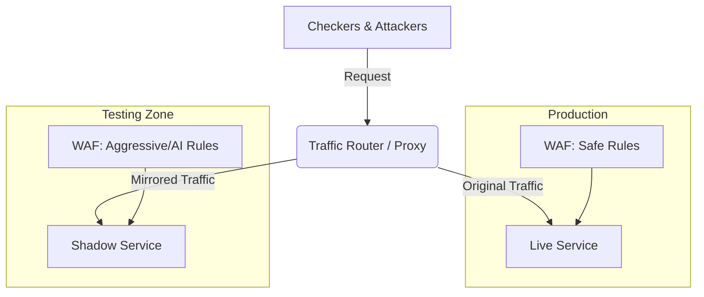

# Traffic Cloning & Safe Rule Testing

In una competizione Attack & Defense (A/D), la **SLA (Service Level Agreement)** è sacra. Bloccare erroneamente il traffico del *Gameserver* (Checker) comporta una perdita immediata di punti, spesso maggiore dei punti persi per un attacco subito.

Per questo motivo, l'applicazione diretta di regole WAF aggressive generate dall'AI (o scritte a mano) sul servizio di produzione è rischiosa. La soluzione è il **Traffic Cloning** (o Mirroring).

## Il Problema: False Positives vs SLA
- **Scenario**: L'AI analizza il codice e suggerisce la regex `DROP TABLE`.
- **Rischio**: Il Checker potrebbe legittimamente inviare stringhe simili per verificare la funzionalità del database.
- **Conseguenza**: Se la regola viene applicata in produzione e blocca il Checker, il servizio risulta "DOWN".

## La Soluzione: Ambiente di Staging (Cloning)

L'idea è duplicare il traffico in ingresso e inviarlo a due servizi paralleli:

1.  **Produzione (Live)**: Il servizio reale che assegna i punti. Qui girano solo regole **sicure e verificate**.
2.  **Shadow (Clone)**: Una copia identica del servizio (container Docker duplicato). Qui vengono applicate le **nuove regole sperimentali**.

### Flusso del Traffico

## Come funziona il Testing Sicuro

1.  **Clone**: Si avvia un container `vuln_service_clone` identico all'originale.
2.  **Replay**: Strumenti come `goreplay` o script custom (es. `replayer.py`) catturano il traffico di rete (pcap o proxy logs) e lo duplicano verso il clone.
3.  **Verifica**:
    - Si applica la nuova regola (es. `RULE: (?i)UNION.*SELECT`) solo sul WAF del **Shadow Service**.
    - Si osserva il comportamento:
        - Se il **Shadow Service** blocca una richiesta che il Checker ha inviato (e che sul Live Service ha avuto successo 200 OK), allora **la regola è un False Positive**. -> **SCARTA LA REGOLA**.
        - Se il **Shadow Service** blocca una richiesta dannosa (e il Live Service è stato exploitato), allora **la regola è valida**. -> **PROMUOVI SU LIVE**.

## Implementazione nel Framework

Nello stack Firegex/Agent:
- **Analisi Statica**: L'agente genera regole potenziali.
- **Fase di Validation (Opzionale)**:
    - L'agente può usare il modulo `simulation/traffic_tools/replayer.py` per simulare traffico registrato in precedenza (PCAP).
    - Se una regola blocca richieste note come "benigne" (storico dei checker), viene scartata automaticamente prima ancora di chiedere l'approvazione umana.

Questo approccio garantisce **Zero Downtime** causato da configurazioni errate del WAF.
