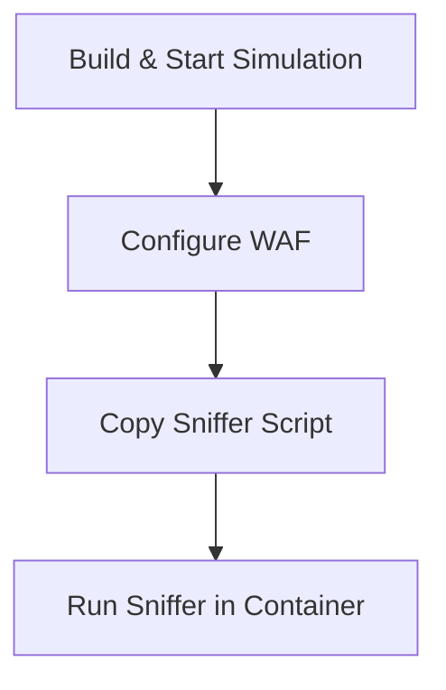

# Simulated Traffic Workflow Explanation

This document explains the process for simulating network traffic and testing the WAF (Web Application Firewall) in the Firegex project. The workflow uses Docker containers and Python scripts to automate the setup, configuration, and verification steps.

## 1. Start the Simulation Environment

First, build and start the simulation environment using Docker Compose:

```sh
docker compose -f docker-compose.simulato.yml build firegex
docker compose -f docker-compose.simulato.yml up -d
```
- **Purpose:**
  - Builds the `firegex` Docker image as defined in `docker-compose.simulato.yml`.
  - Starts all services in detached mode, including the simulation test container (`firegex_sim_test`).

## 2. Configure the WAF

Configure the WAF by running the provided Python script:

```sh
python3 tests/configure_waf.py
```
- **Purpose:**
  - Sets up the WAF rules and environment for the simulation.
  - Ensures the WAF is ready to inspect and filter simulated traffic.

## 3. Copy the Sniffer Script into the Container

Copy the `verify_cloning.py` script into the running simulation container as `sniffer.py`:

```sh
docker cp tests/verify_cloning.py firegex_sim_test:/tmp/sniffer.py
```
- **Purpose:**
  - Prepares the sniffer script inside the container for execution.
  - The script will be used to monitor and verify the simulated traffic.

## 4. Execute the Sniffer Script

Run the sniffer script inside the simulation container:

```sh
docker exec firegex_sim_test python3 -u /tmp/sniffer.py
```
- **Purpose:**
  - Starts the sniffer in unbuffered mode for real-time output.
  - The script monitors network traffic and verifies correct traffic cloning and WAF behavior.

---

## Summary Diagram



## Notes
- Ensure Docker and Python 3 are installed on your system.
- The container name `firegex_sim_test` must match the name defined in your Docker Compose file.
- The sniffer script (`verify_cloning.py`) should be present in the `tests/` directory.

---

This workflow enables automated, repeatable testing of simulated network traffic and WAF functionality in a controlled environment.